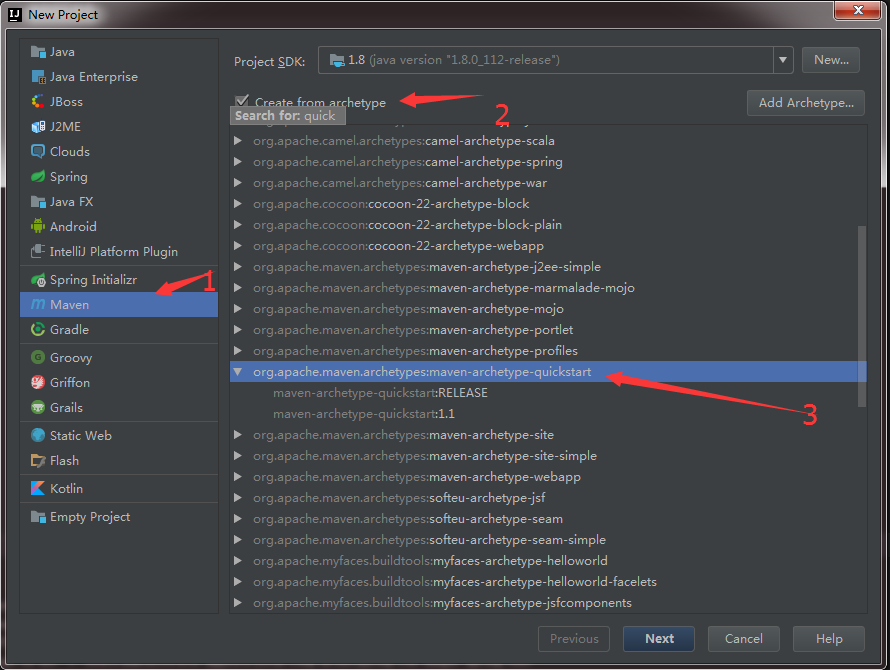

# 这是用idea开发的spring的demo

## 1.新建项目


## 2.添加依赖
```
    <dependency>
      <groupId>org.springframework</groupId>
      <artifactId>spring-context</artifactId>
      <version>4.3.11.RELEASE</version>
    </dependency>
```

## bean的自动装配
<bean>的autowire属性
byType
    根据类型自动装配
byName
    根据名字
construct
    根据构造器(不推荐使用)

## 注解
@Component @Controller @Repository  @Service

<context:include-filter>
<context:exclude-filter>

